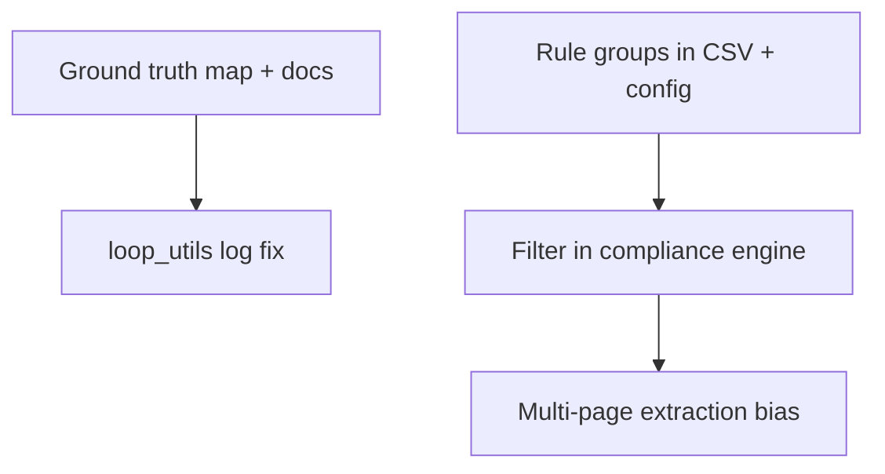

# Rules taxonomy, ground truth, and adaptation of prior findings

## A. Problems inventory (from logs and code review)

### A1. Ground truth scoring looks like "2 columns"

- **Cause:** [`config/csv/ground_truth.csv`](config/csv/ground_truth.csv) has many columns, but [`evaluate()`](src/learning/evaluator.py) only compares truth keys that exist in the **current invoice type’s extraction field set**. [`ground_truth_column_map`](config/config.yaml) maps CSV headers to `field_name`s; many map to **VIAJES/EQUIPOS** fields, so for **PERS_LOCAL** only overlapping keys (e.g. `expense_category`, `payment_method`) participate.
- **Adaptation:** Extend column map + CSV values for payroll fields (`employee_name`, `pay_period`, `gross_salary`, `net_salary`, …) and/or **per-type CSV** via `ground_truth_csv_by_invoice_type`.

### A2. Compliance rules vs document reality (Galicia / 2023 / stamps)

- **Cause:** Visual rules (e.g. Xunta stamp, 2023 period, PR811A) assume **Spain/Galicia grant** context. Chad/JRS/French bundles **fail** those checks even when extraction works.
- **Adaptation:** **Rule groups** (`general` vs `xunta_galicia`) + config **`active_rule_groups`** or **`project_id`** so non-Galicia runs do not apply Galicia-only rules. Your taxonomy: general eligibility vs Xunta-specific caps and stamps.

### A3. Misleading `extracted 0 fields` in logs

- **Cause:** [`log_tool_result`](src/agent/loop_utils.py) counts non-null keys in `result["extracted"]`. Hybrid **OCR-direct** can merge into state while the last vision JSON is all nulls, so the line reads **0** despite `merge.updated` being non-empty.
- **Adaptation:** Log **merge.updated**, `len(null_fields)`, or cumulative non-null in **state** after the tool.

### A4. Structured extraction vs compliance visual

- **Cause:** Same model can pass **R_PL_011** (name/role/period visible) while **`extract_fields_vision`** returns nulls for schema keys—different prompts/tasks.
- **Adaptation:** Smaller **`field_subset`** per call; mandatory **second pass** on pages **2–3** when inventory marks SIGNATURE_STAMP / SUPPORTING_DOC; optional **backfill** from structured visual outputs (larger change).

### A5. Agent skips planned second `extract_fields_vision`

- **Cause:** LLM-driven loop may jump to `check_compliance` after one extract despite a 6-step plan listing two extractions.
- **Adaptation:** Stronger system prompt / execution-plan adherence; or **fixed pipeline** path that always runs N extract steps by page category.

### A6. Ground truth label conventions

- **Cause:** e.g. `personnel` vs `Personal voluntario`—evaluator strict string match flags mismatch.
- **Adaptation:** Normalization map for `expense_category`, or tolerance rules in [`_compare_value`](src/learning/evaluator.py) for known synonyms.

### A7. Inventory / model inconsistency (dates)

- **Cause:** Page inventory sometimes misreads year (e.g. 2023 vs 2025); noisy hints to the agent.
- **Adaptation:** Optional cross-check against OCR text; do not treat inventory as sole source of truth for dates.

---

## B. Testing strategy

| Fixture | Purpose |
|---------|---------|
| **Galicia-aligned** invoices | Stamp, grant ref, expediente, 2023 window, PR811A — validates **`xunta_galicia`** rule group |
| **Chad / non-Galicia** (current PDFs) | General rules only when **`active_rule_groups: [general]`** — avoids false FAILED from stamp rules |

---

## C. Rule taxonomy (locked to your lists)

- **General (all projects):** identity, dates, amounts, currency, payment method stated, proof/attachment, documentation match, translation policy, and any stamp checks you want **only if** framed as "if sponsor stamp present" vs hard-coded Xunta text.
- **Xunta-specific:** economy class, expatriate housing, external transport limits, sanctions/fines, judicial costs, amortization, protocol, dismissal indemnities, PR811A, personnel/indirect/field caps, audit/evaluation limits, etc.

Implementation: new CSV column(s) e.g. **`rule_group`** = `general` | `xunta_galicia` (default `general` for backward compatibility), plus **`agent.active_rule_groups`** in YAML.

---

## D. Implementation phases (when executing)

1. **Docs + GT:** README or YAML comments explaining column map vs type overlap; extend map and CSV rows for payroll.
2. **Logging:** Fix `extract_fields_vision` summary in `loop_utils.py`.
3. **Rules:** Schema + loader + filter + migrate and tag rows; visual rules respect same filter.
4. **Extraction behavior:** Prompt/plan/pipeline changes for multi-page extract (choose smallest incremental slice first).
5. **Eval:** Optional synonym/tolerance for category-like fields.
6. **Fixtures:** Add or label two PDF classes for CI/manual regression (optional).

---

## E. Out of scope unless explicitly added

- Removing Galicia rules entirely (prefer **filtering**, not deletion).
- Full **backfill** from visual to `extracted_fields` without a small design review (security/consistency).

---

## F. Dependency order

Rule filtering reduces **false FAILED**; GT and logging improve **measurable feedback**; multi-page extraction addresses **missing fields** independent of jurisdiction.
