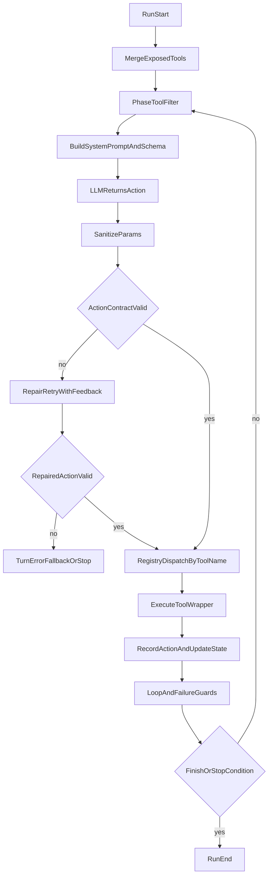
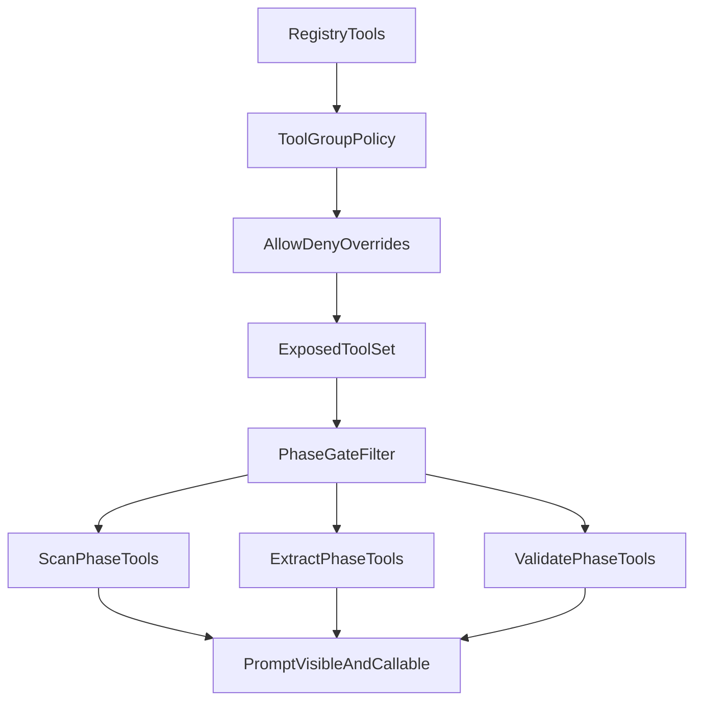
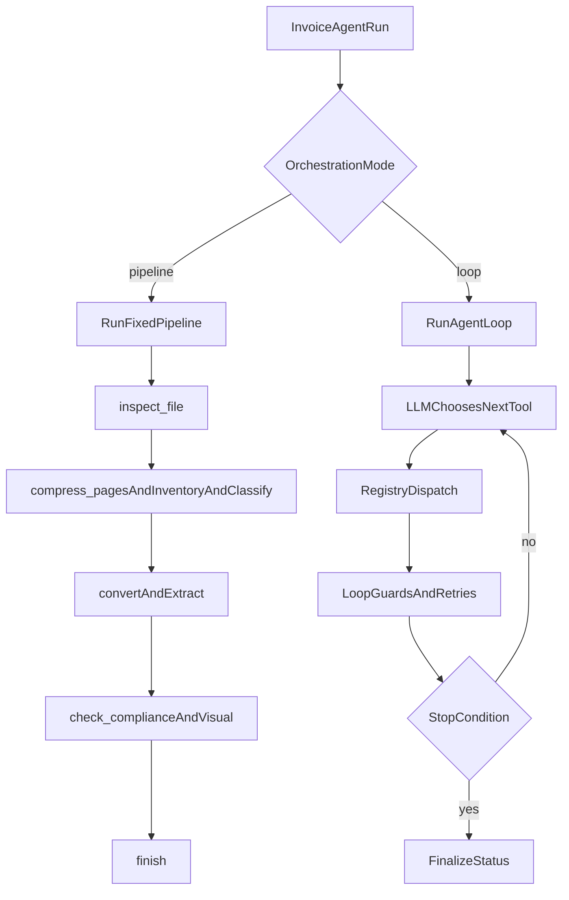

# Agent Architecture

This document explains how the agent decides which tool to call, which tools are available per phase, and how execution differs between `loop` and `pipeline` orchestration modes.

## 1) Tool Selection and Dispatch (Loop Mode)

Mapped files:
- `src/agent/agent.py`
- `src/agent/turn.py`
- `src/agent/action_contract.py`
- `src/agent/registry.py`

Last validated with code: current working tree

How to read this:
- `MergeExposedTools` is policy-driven (`tool_groups_enabled`, learnings toggle, allow/deny overrides, mandatory `finish`/`note`).
- `PhaseToolFilter` narrows the set further based on phase state and guard conditions.
- `BuildSystemPromptAndSchema` constrains tool and params through dynamic JSON schema.
- Contract validation runs before dispatch; invalid actions get one repair retry before fallback/stop paths.

## 2) Per-Phase Available Tools

Mapped files:
- `src/agent/phases.py`
- `src/agent/tool_policy.py`
- `config/config.yaml`
- `src/agent/prompts.py`

Last validated with code: current working tree

### 2.1) PhaseToToolSet quick reference

The list below reflects phase-gated tool sets from `src/agent/phases.py`, then intersected with the exposed set from `src/agent/tool_policy.py`.

- `SCAN`
  - `inspect_file`, `compress_pages`, `inventory_pages`, `classify_document_type`, `read_learnings`
  - Always-available controls: `note`, `install_package`
- `EXTRACT`
  - `convert_pdf_to_images`, `extract_fields_vision`, `crop_region`, `check_compliance`
  - Review/learnings helpers: `flag_for_human_review`, `flag_fields_for_review`, `read_learnings`, `write_learning`, `edit_learning`, `delete_learning`
  - Always-available controls: `note`, `install_package`
- `VALIDATE`
  - `check_compliance`, `check_compliance_visual`, `extract_fields_vision`, `crop_region`, `finish`
  - Review/learnings helpers: `flag_for_human_review`, `flag_fields_for_review`, `write_learning`, `edit_learning`, `delete_learning`
  - Always-available controls: `note`, `install_package`

Dynamic phase constraints:
- Before classification, allowed tools are tightened to one required step at a time: `compress_pages` -> `inventory_pages` -> `classify_document_type`.
- After full-quality render exists, `convert_pdf_to_images` is removed.
- In `VALIDATE`, repeated identical compliance outcomes can suppress repeated `check_compliance`.

Configuration notes:
- Baseline exposure comes from `agent.tool_groups_enabled` (default includes `pipeline` group).
- Learnings CRUD tools are included if `agent.learnings_tools_enabled: true`.
- `tools_extra_allow` and `tools_extra_deny` apply after group merge.
- `finish` and `note` are forcibly exposed in loop mode when present in registry.

## 3) Orchestration Modes

Mapped files:
- `src/agent/agent.py`
- `src/agent/pipeline.py`

Last validated with code: current working tree

## Diagram Maintenance Checklist

Update this file whenever any of the following changes:
- Tool registry keys change in `src/agent/registry.py`.
- Phase gates or phase definitions change in `src/agent/phases.py`.
- Group exposure or allow/deny merge logic changes in `src/agent/tool_policy.py`.
- Action schema/contract behavior changes in `src/agent/turn.py` or `src/agent/action_contract.py`.
- Orchestration branch behavior changes in `src/agent/agent.py` or `src/agent/pipeline.py`.

Recommended review routine:
1. Update diagram nodes/edges first.
2. Update `PhaseToToolSet` quick reference second.
3. Run one loop-mode and one pipeline-mode smoke test.
4. Include "diagram sync" note in the PR description when orchestration changes.
